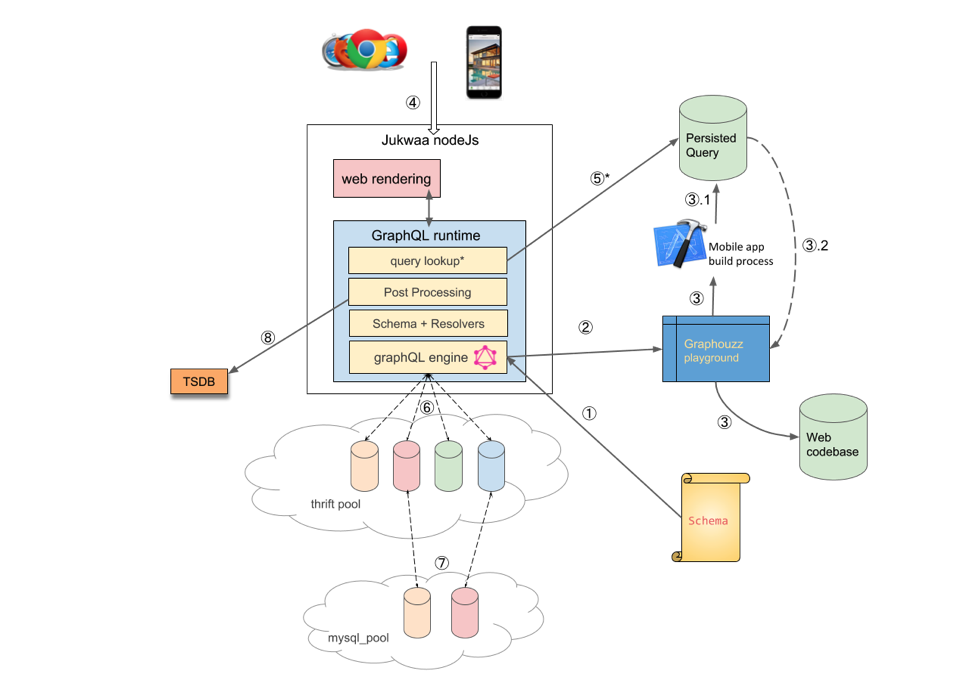
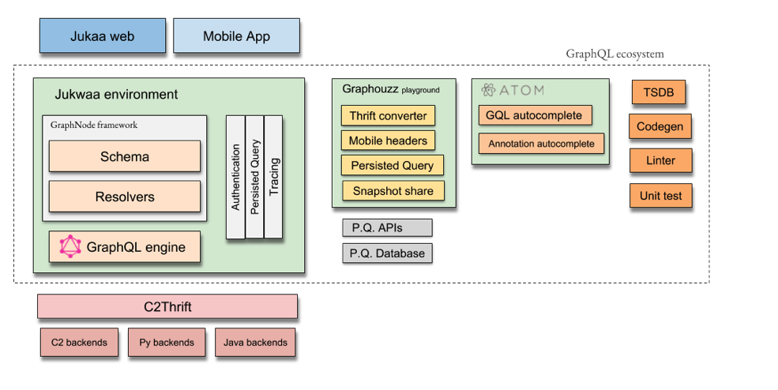

# GraphQL in HZ

### Introduction
GraphQL(http://graphql.org) is a data aggregation framework open sourced by facebook in 2015.
It replaces traditional RESTFUL by letting the client to describe exactly what it wants, and how response should look like, based on pre-defined object schema.

Based on GraphQL, we provided an framework where it is super easy for graphql developers to deliver highly maintainabl ecode and apply advanced features sucn as bathing without much scaffolding. 

### Goal
1. A common thin layer for all frontends, web or native, to retrieve HZ objects
2. An asynchronous system that’s high performant and low footprint
3. A strong type schema system with clear documentation

### Architecture
The following shows the architecture diagram. Steps breakdown:
1. Schema is defined (at least with mock data). Schema pushed to runtime
2. FE developer use graphiQL tool to construct query, review query performance                   
3. Optionally, FE developer can upload query to QMS to reduce payload over network
4. Mobile client calls server (middleware) with the qid + query variables + more
5. Meanwhile, web browser calls Jukwaa server asking for a page
6. Jukwaa web passes graphQL request to middleware (no network hop)
7. *qid -> graphQL query lookup (related to step 3, optional)
8. Backend federations, fan-out.
9. For both mobile and web, graphQL response is returned.
10. Meanwhile, graphQL execution metrics is logged. This updates graphiQL performance.

### Ecosystem

The ecosystem contains 
1. Node.js with GraphQL schema and resolver, which are organized in the graph.
2. Utility Framework, leveraging JS decorators pattern and inspired by other frameworks such as SpringBoot.
3. Atom plugin, which makes it ieasier to create GraphQL nodes and connections
4. Monitoring system based on TSDB and Bosun. 
5. Development tools for higher productivity.

### Highlight
GrapHZ is the first framework in industry with ease of use and as a thin and lightweight layer. 
It is well tested in large scale of traffic and adopted by some other companies. 
