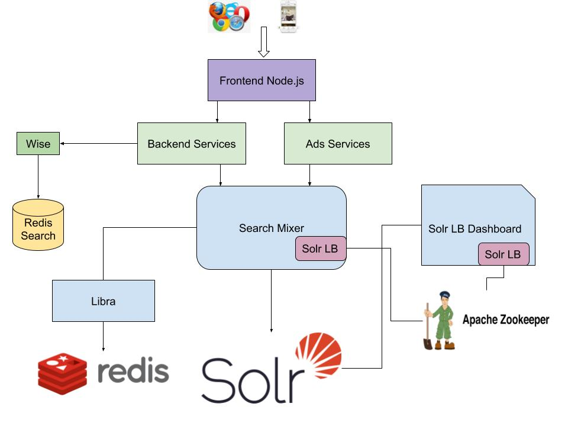
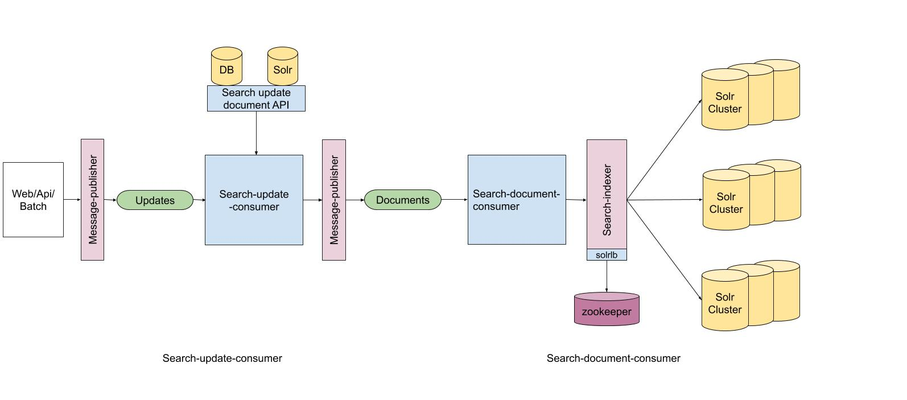

# Search Mixer and Indexer in HZ
In the past one year, I led the team to build the searchmixer and indexer to improve the stabality and scalability of the search backend system. 

## Introduction
Search is central to powering significant part of user experience at HZ. Before searchmixer and indexer launched, the search flow and index flow are not structured. Different vertical teams are composing their own search queries, making the system extremely complicated and hard to maintain. 

For search flow, we introduced searchmixer. 
SearchMixer is to solve these problems. It is a standalone service which is a bridge between the client(php) and backend search service(Solr). It encapsulates all the query related logic originally from php, and the php client only needs to call it with search context. The benefits are:
1. Maintainability. Move search logic to a service, clearly separate all search related logic from php code. Make the coding, testing and maintenance easier
2. Abstraction. Provide an abstract layer(a query class) to reduce the dependency on Solr
3. Parallelization. Parallelize underlying search calls
4. Logging. Abstraction enables logging down query logic changes for different code paths.

For index flow, we introduced two indexing pipeline based on kafka.
Index pipeline v1 is for non-heavily updated verticals, like gallery, user, order, etc
Index pipeline v2 is for heavily updated verticals, like photos and products.

## Search flow

Search flow involves searchmixer, Solr, wise and libra. When a front search/browse request comes in, it will:
1. call wise first to do query-rewrite, construct a search-mixer request, and then call searchmixer to actually perform the search
2. once searchmixer get the request, it will construct the Solr queries based on the request, It then do a loadbalancing to figure out which Solr nodes the queries should be send to, and send the query
3. once searchmixer get the requests from Solr, it may merge the results depends on the query logic.
4. searchmixer will call libra to do personlization

### Search Mixer
SearchMixer integrates all the query generation logic. It needs to generate query based on the SearchMixerContext and sends the query to search backend.

We use plugin architecture. Developers can create plugins and put the query generation logic in their own plugins to generate queries. Plugins need to be registered and they are executed in the order in the registration.
Plugin will only work on an internal class SearchParams for pre-processing and SearchResults for post-processing. These class are introduced to decouple the plugin logic as much as possible to the Solr search backend. Final query will be generated from SearchParams.
We also provide some common plugin implementation like stopwords etc.
We also implemented a few common component to generate the query. These components will each generate part of the query after all the user plugins are called. Search developer can manipulate the behavior by change the setting of these components.

## Index flow
Indexing flow is responsible for persisting changes(updates) into the search backend. 

#### Indexing Pipeline V1
The V1 pipeline comprises of the following components:
1. Web/Batch/API: The origin of updates. The updates are either generated organically by users or through batch scripts. The updates are published to Kafka via message-publisher
2. message-publisher: A Thrift based service that acts as a proxy for Kafka Producer. It receives messages and the topic name from the clients and produces it to the Kafka.
3. search-update-consumer: The search-update consumer consumes messages from the updates topic, looks up in the DB by calling SearchUpdateDoc API, then sends this indexable document to documents topic via message-publisher. It also sends partial updates and deletes to the documents topic.

4. search-document-consumer: The search-document consumer consumes messages from documents topic and calls searchindexer.
5. searchindexer: The Searchindexer is a Thrift based service that updates the Solr backends. The SolrLB module is responsible for discovering leader endpoints for Solr clusters. The searchindexer also provides routing information for routing the documents to the appropriate shards.

#### Indexing Pipeline V2
The indexing flow V2 was introduced in order to support offline index builds. The scope of this flow is limited to photos and products.
##### Kafka consumers
1. search-kvstore-updater
The search updates from WEB/API and the search batch updates from batch scripts are consumed by a new consumer called search-kvstore-updater. This consumer processes these updates and sends it to KV-Store. The current version of KV-Store is a Solr index which has all the fields of the production index as only “stored”. In future the KV-Store can be of any type. The consumer only publishes “online” updates to an output Kafka topic.

2. search-online-update-consumer
This consumer consumes the output messages from search-kvstore-updater. The full updates are performed by looking up in the KV-Store. It sends the updates to SearchIndexer, which in turn updates Solr clusters.

##### Search Offline Indexing
The offline indexing flow is based on alias concept in Solr. Though it does not Solr’s alias support directly. It uses this mechanism to direct writes to a particular index(or multiple indices).
The clusters are updated to host two indices, one which is currently in traffic referred to as “current” and one that’s is inactive(serving no reads or taking no writes), referred to as offline. The offline indexing flow can be summarized by the following steps:

Look up the current state of the cluster.
Delete all documents in offline index.
Enable dual write for online updates on both current and offline index
Run the indexer script to index all documents from KV-Store into offline index. Wait for it to complete
Switch the offline index as the current index and the current index to offline
Disable dual writes and send updates to current index.
The diagram below illustrates the entire flow. The offline indexing flow is orchestrated by the index-manager component. This component is responsible for managing aliases, and the entire lifecycle of the indexer script.

### Highlights
1. We reached the goals of search backend system with maintainability, abstraction, parallelization and better logging.
2. The vertical search development is much faster and more efficient powered by searchmixer. 
3. The indexing pipeline is more reliable and the v2 index pipeline powered the ranking system, making the machine learning iteration faster and providing more data to train. 

