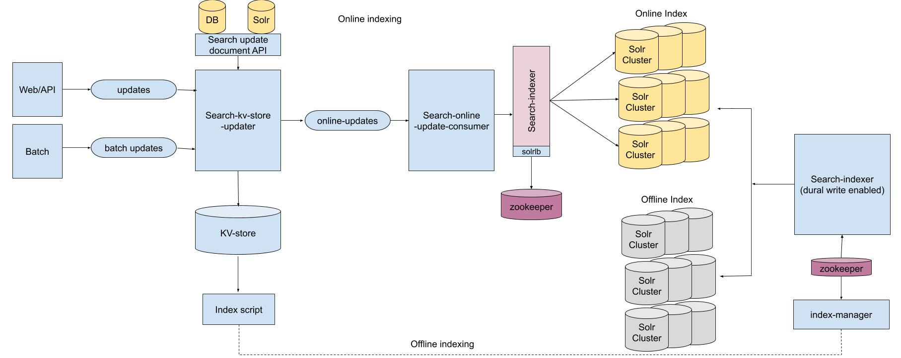

# Search Mixer and Indexer in HZ
In the past one year, I led the team to build the searchmixer and indexer to improve the stabality and scalability of the search backend system. 

## Introduction
Search is central to powering significant part of user experience at HZ. Before searchmixer and indexer launched, the search flow and index flow are not structured. Different vertical teams are composing their own search queries, making the system extremely complicated and hard to maintain. 

For search flow, we introduced searchmixer. 
SearchMixer is to solve these problems. It is a standalone service which is a bridge between the client(php) and backend search service(solr). It encapsulates all the query related logic originally from php, and the php client only needs to call it with search context. The benefits are:
1. Maintainability. Move search logic to a service, clearly separate all search related logic from php code. Make the coding, testing and maintenance easier
2. Abstraction. Provide an abstract layer(a query class) to reduce the dependency on solr
3. Parallelization. Parallelize underlying search calls
4. Logging. Abstraction enables logging down query logic changes for different code paths.

For index flow, we introduced two indexing pipeline based on kafka.
Index pipeline v1 is for non-heavily updated verticals, like gallery, user, order, etc
Index pipeline v2 is for heavily updated verticals, like photos and products.

## Search flow

Search flow involves searchmixer, solr, wise and libra. When a front search/browse request comes in, it will:
1. call wise first to do query-rewrite, construct a search-mixer request, and then call searchmixer to actually perform the search
2. once searchmixer get the request, it will construct the solr queries based on the request, It then do a loadbalancing to figure out which solr nodes the queries should be send to, and send the query
3. once searchmixer get the requests from solr, it may merge the results depends on the query logic.
4. searchmixer will call libra to do personlization

### Search Mixer
SearchMixer integrates all the query generation logic. It needs to generate query based on the SearchMixerContext and sends the query to search backend.

We use plugin architecture. Developers can create plugins and put the query generation logic in their own plugins to generate queries. Plugins need to be registered and they are executed in the order in the registration.
Plugin will only work on an internal class SearchParams for pre-processing and SearchResults for post-processing. These class are introduced to decouple the plugin logic as much as possible to the solr search backend. Final query will be generated from SearchParams.
We also provide some common plugin implementation like stopwords etc.
We also implemented a few common component to generate the query. These components will each generate part of the query after all the user plugins are called. Search developer can manipulate the behavior by change the setting of these components.

## Index flow

#### Indexing Pipeline V1

#### Indexing Pipeline V2

### 3 Highlights

