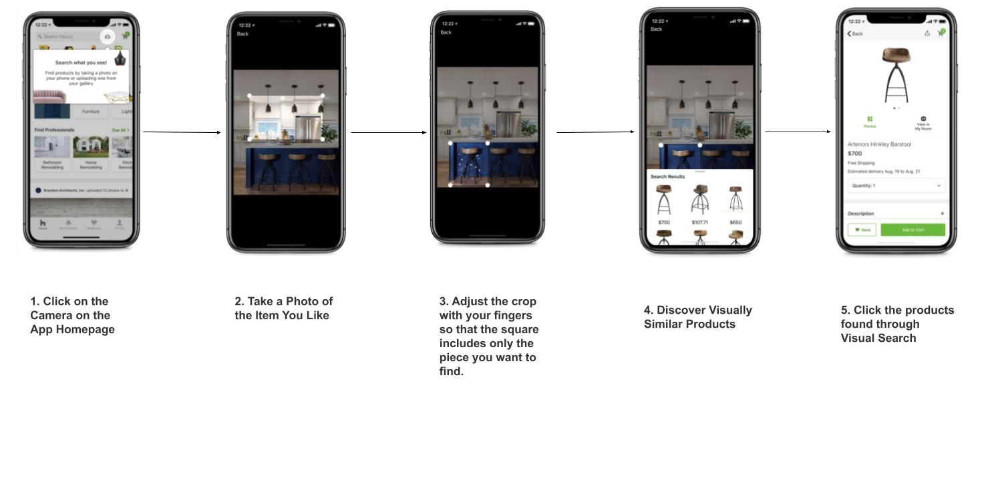
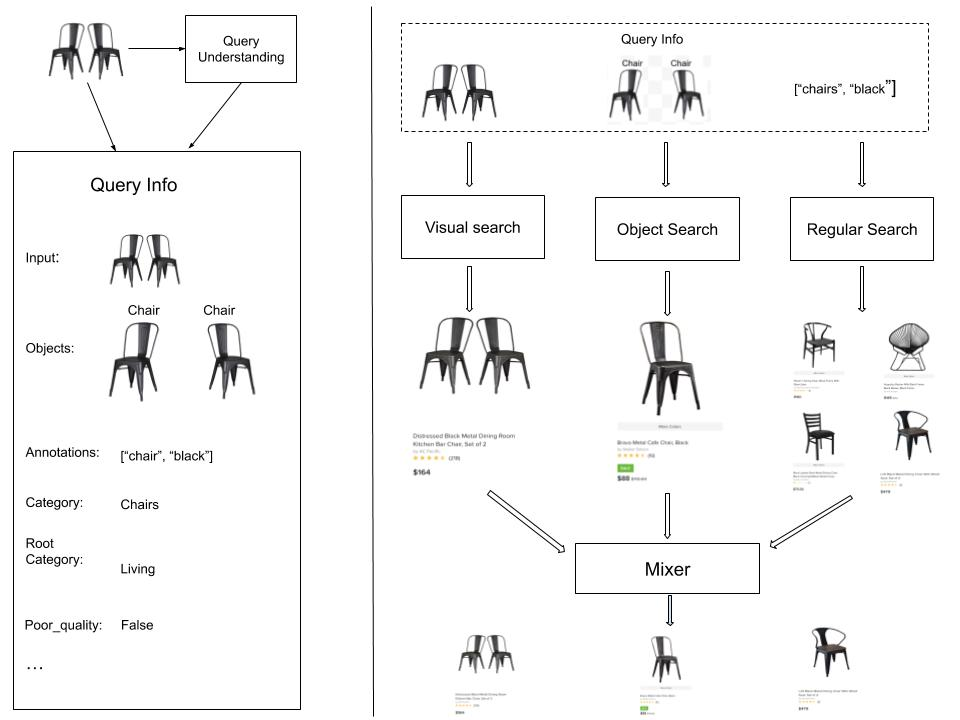

# Visual Discovery Engine in HZ

## Introduction
Visual discovery (visual search + recommendation) become more and more important driven by explosive growth of online photos and videos. It gets benefits from the advances in Computer Vision and the findings that a large proportation of users prefer using discovery systems to browse(getting inspiring ideas) rather than to search(finding answers). In HZ, the discovery engine powered the visual match and visual search (a.k.a HZ Lens).

## Applications
#### [HZ lens](https://www.houzz.com/magazine/find-products-for-your-home-using-visual-search-in-the-houzz-app-stsetivw-vs~124819294)
##### HZ Lens Flow

##### HZ Lens components
  
There are two components.  
Left: query understanding layer first computes visual features. 
Right: Mixer layer then retrieves results from different content sources 

#### [HZ Visual Match](https://www.houzz.com/magazine/inside-houzz-find-products-for-your-home-with-visual-match-stsetivw-vs~73421107)

## Experiments and Lessons
#### Feature representation
We adopt and evlauted several popular classification models(in the beginning of 2018) such as GoogLeNet[], VGG16[] and variants ResNet101 and ResNet152[]. Besides raw features, we also tried binarized[] reprentations of these features. Binarized reprentating features benefit us because of their smaller memory usage, which is important on production enviroment. In addition, we also compared the Euclidean(L2) and Manhattan(L1) distance metric for the raw features. 

We trained the base models on ImageNet classification[] and HZ dataset. HZ pictures are generally with higher qualities and have different statistics. For HZ dataset, the models are fine-tuned by replacing the softmax classification layer of a pre-trained base model with a new classification layer, trained to classify HZ images, initialized using the same intermediate and lower level weights. 

To evlaute the visual models, we get 1000 images from the evalutation dataset as query images and the rest are indexed using the image reprentation being evlauted. Then we retrieved a list of result for each test image, sorted by distance. The result is assumed to be revelant to the test image if two iamges share the same class label. From the list of results with the associated class labels, Precision @ K metrics is used to evlauted the performance of the visual models. 

There are some interesting findings.
1. When using raw features, intermediate features (ResNet101/ResNet152-pool5, VGG16-fc6, VGG16-fc7) result if better than more semantic features (VGG16-fc8, ResNet101-fc1000, ResNet152-fc1000) in retrieval performance.
2. For the raw features, ResNet152-pool5 features with L2 distance has the best performance.
3. With binarized features, VGG16-fc16 performances the best among the test. The binarized fc16 features are 16x smaller than the raw ResNet-pool5 features. 
So, taking the memory usage on production and the test performance into consideration, we choose the VGG16-fc6 as the feature retrieval model. 

#### Object Detection
We tested Faster R-CNN and Single Shot Detection(SSD)
###### Faster-R-CNN:
We trained the Faster R-CNN with VGG16 and ResNet101 as the bone network. And also when training the Faster R-CNN models, we took of a few differences compared with the original paper. 
1. Direct end-to-end optimization was used in the experiment, which was different with the alternating optimzation in the orignal paper. 
2. For the ResNet101 backbone of Faster R-CNN, during the experiment, if the number of proposals was decreased from 300 to 100, we could gain significant computation savings without impact precision and recall. 

The Faster-R-CNN is firstly adopted in the **Visual Match** system. It's higher accuracy is welcome. However, In Visual Match System, the Faster-R-CNN is relying on agressive caching, coupled with dark reads during models swaps for cache warning. 
So, in our **Object Search System** (part of the HZ Lens), we took advantage of the SSD because speed is the top concern with acceptable accurancy. 

###### SSD
We trained the SSD with a very close architucture of the original paper proposed. There were a few key differences. 
1. We changed the IoU threshold to 0.7 from 0.5 to ensure the resulting detections tightly bound the objects. 
2. With the 0.7 IoU threshold, our model used 1 stride for all additional convolutions layers, since we found that the original strides of 2 led pool localization performance when the IoU was set to 0.7.

#### Covnet feature for recommendation

